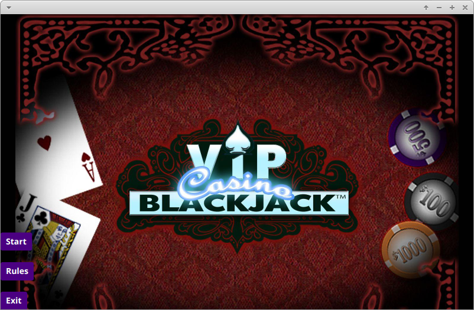

# JavaFX Blackjack Game

This is a JavaFX-based implementation of the classic casino card game, Blackjack. The game features a graphical user interface, allowing the player to interact with the game using buttons and other UI elements. The game is built using the Model-View-Presenter (MVP) design pattern.



## Getting Started

### Prerequisites

To run this application, you need to have the following software installed on your system:

- Java SE Development Kit (JDK) 8 or higher
- Maven 3 or higher

### Running the Game

To run the game, navigate to the root directory of the project in your terminal and run the following command:

```
 mvn javafx:run
```

This will launch the game window.

### Playing the Game

The game follows the standard rules of Blackjack:

1. The player is dealt two cards, face up.
2. The dealer is dealt two cards, one face up and one face down.
3. The player can choose to hit (receive another card) or stand (keep their current hand).
4. If the player's hand exceeds 21 points, they lose the game (bust).
5. If the player stands, the dealer reveals their face-down card and continues to hit until they have at least 17 points.
6. If the dealer's hand exceeds 21 points, the player wins the game.
7. If the dealer's hand is higher than the player's hand without exceeding 21 points, the player loses the game.
8. If the player's and dealer's hands have the same point value, the game is a tie (push).

## Development

### Dependencies

The project has the following dependencies:

- JavaFX 8 or higher
- JUnit 4.12 (for unit testing)


